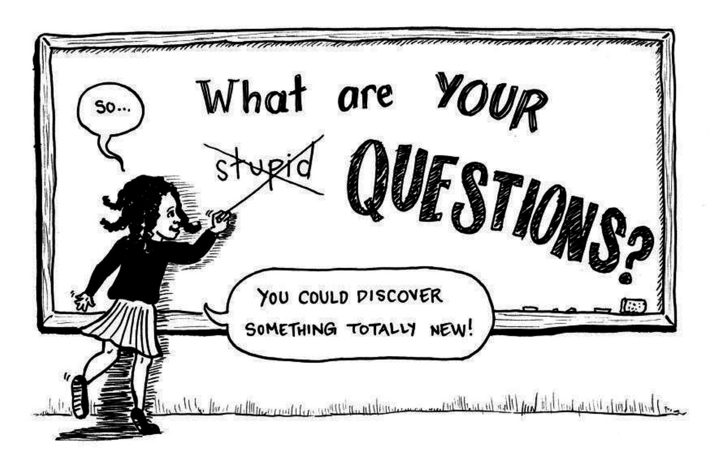

## **To Ask or Not To Ask?**
Asking questions is something I'm sure you've been told on your first day at kindergarten and you're probably tired of hearing it because I'm sure your Biology 101 teacher just told you "Don't hesistate to ask questions during the lecture!". As we all know, questions are a great thing! We can use this noun to get ourselves one step closer to answering what we don't know, but in the 21st century, we have such an abundance of resources available on this beautiful invention we call the internet with approximately 7 billion people using it, most of the questions you have are probably answered somewhere on the internet. So do you really need to ask every question that comes to your mind? In a jiffy, no. To explain, let me use software engineering as an example.
