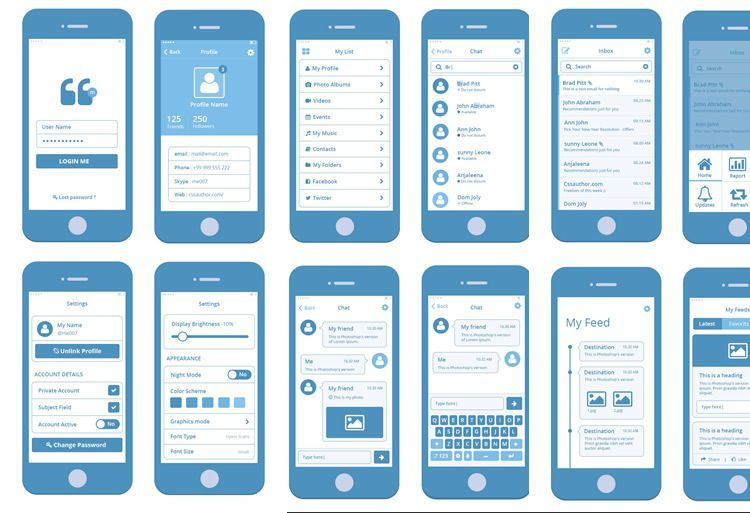

Throughout my whole life, I've been always dedicating myself to be creative by taking pictures and editing videos for professional gamers. For example, when I edit a video, I am in control of the atmosphere and the pace of it. I am able to create them by the color grading and the sync of the video to the song. When college came around, I wanted to set foot into a more serious field of design. I started off as an electrical engineer major, but I felt like it wasn't allowing me to express myself enough, which is why I decided to become a computer science major.

During the beginning of computer science, I felt like there wasn't much design to it, but once I learned about software engineering and how it plays a huge role in designing websites, apps, etc., I became motivated once again and decided to take a Software Engineering class. I feel like being able to design something in your own way allows you to think more freely. We all know in math and science, there is always a formula or a set way to do something. Yes, there may be two, three, or five ways to do something, but there are always rules. When it comes to art and design, there is no rules. The only thing that can limit you is your own creativity.

Since I am now enrolled in a Software Engineering class, I hope to learn about web development and UI designing. I want to be able to design a UI of my own. I also hope to experience working with others on a project. I have never done a project with group members before so I hope this class will provide some sort of project that requires team work, as team work is very important in the real world of software engineering!

