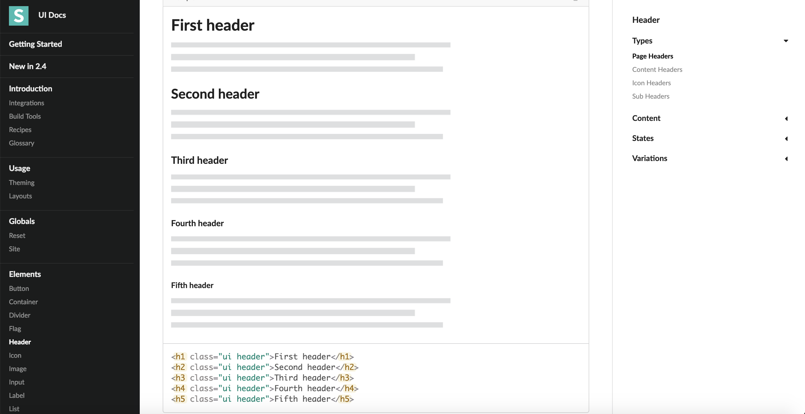

##** What makes a website appealing?**
Being in the 21st century most people know how to use a device to browse the internet and everything always looks pretty. The reason why your twitter feed, YouTube, etc., looks pretty is because of the hard working web developers behind it. As usual, new technologies are being constantly invented and with technology progressing so fast, people have created a sort of "plug-in" technology for web developers called UI frameworks. UI frameworks are like a new language because you are implementing code that another person has written into your own. With that in mind, many web developers still decide to use UI Framworks, but why? 

##** Why a UI Framework?**
Many web developers choose to use UI Frameworks written by other people because it saves themselves time from building their own. The amount of time you spend learning their code is much more shorter than building one from the ground up. Most UI Frameworks have their own examples of code that you can copy and paste, and have communities that can assist you when problems arrive. A great example is Semantic UI. In Semantic UI, they have indexes for every single thing you can create, such as: menus, icons, images, etc. These indexes contain examples of what you are creating and the many different styles of it, and also the code for it so you can copy and paste it into your own index.html file. 

From a personal perspective, I felt so amazed when I first discovered Semantic UI. When I began coding basic html and css programming, my websites always looked like it was from the 80s. After implementing Semantic UI into my html and css, everything looked so professional and clean. I was able to create top bar menus, change background to images, dropdown menus from icons, and footers. It took me a while to get a the hang of learning Semantic UI, but everytime I found myself stuck, I just looked up "Semantic UI" plus whatever I was looking for, and Semantic UI had a page for it. By no means am I an expert at Semantic UI yet, but I can definetly tell you that it is worth trying out, it will change your life. And if you don't like Semantic UI, there are many other options out there such as Bootstrap or React. 
