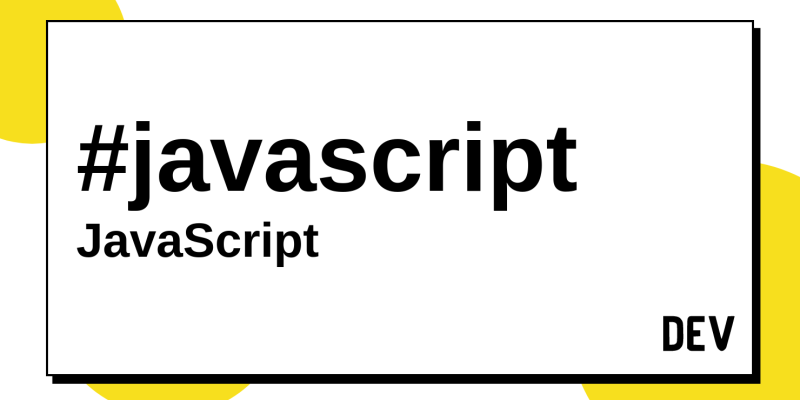

## **First Experience**
I recently started taking a software engineering class and one of the main goals of this class is web development, which ultimately led me to begin coding in Javascript. I've been only coding seriously for roughly over 8 months now and the only language I have used is Java. I have done some C coding about two years ago, but I don't remember much from that. As a complete newbie at Javascript, I began doing the Introduction to Javascript module from FreeCodeCamp and after completing that introduction, I realized that Javascript isn't difficult to work with at all.

 
 
## **My Unpopular Opinion**
Javascript's loops and control statements are like Java's, the syntax is pretty much the same when it comes to typing these loops and statements. Despite the similarities, there are differences present between the two. Javascript is a "weakly typed" language, meaning that not everything needs specification. For example, a semicolon (;) is required at the end of every code in Java or else the code doesn't run correctly and defining the type of variable is required. Meanwhile, in Javascript, simply missing a semicolon in a line of code does not crash the code nor will not specifying your variable. You can simply get away with initializing a variable with "var" or "let." Yes, I know this sounds too good to be true, but it's true. Although this makes life ten times easier, the perk of Javascript is also its own downside. 
Everyone enjoys a bit of freedom, but the freedom that Javascript provides can lead to bad habits in coding. Let's say that someone is completely new to coding and it just so happens that he or she begins coding in Javascript. They may pick up habits of not double checking their code for missing semicolons and if they were to move on to a more strict language such as C or Java, they will need to learn about specifying the type of variable. Like any other language in programming, there is a pro and con to it and from my experience, I recommend trying out Javascript. It never hurts to know a new language and Javascript is important when it comes to web development. 

## **Taking Javascript to the Next Level**
It may be relatively easy to learn a new language in code, but what is more important is how effective one is at using it; that is where "athletic" coding comes in to play. Athletic coding is training one to code within hours and minutes instead of days and weeks. To sharpen someone's skill in coding, there is a strategy called WOD (Workout of the Day). In this exercise, the participant is given a certain time limit, usually 10-12 minutes to code a simple function, such as, converting temperatures between celsius and fahrenheit. From my personal experience with WODs, I found it quite stressful as it was my first time. I was given such a simple problem; detecting vowels in a given string, but I was still not able to solve the problem in 12 minutes due to the stressful situation. I pretty much failed the WOD, but I find it great to sharpen my speed in coding and thinking and help me to keep calm in stressful situations.

