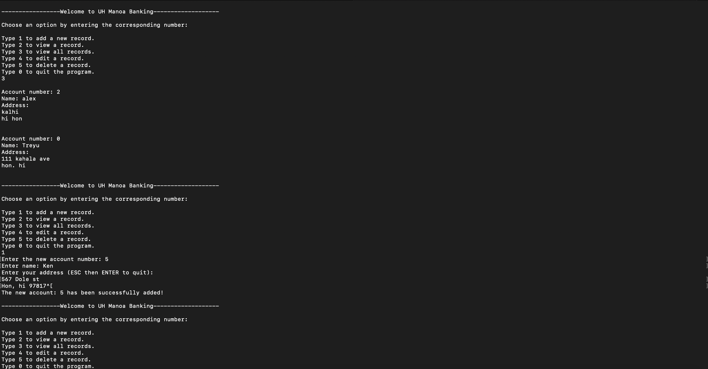

## Bank Database Software
This application allows users to add, view, delete and modify the address of a record.
 
I created this with a singly linked list data structure in C first as a project for my ICS 212 class. I then converted it into a C++ program. 
 
Each record in the database contains an account number, name, and an address. We needed to be able to add new records without duplicate account numbers and the program should sort all records in descending order. 
 
There are two viewing options in this program. You are able to view a specific account number by providing the account number, or you can view all accounts in the database. The delete option takes in an account number and will delete the account associated with the account number if it exists.
 
Lastly, there was an option to modify the address of an existing account number. All information in the bank database is saved into a text file that is generated if one doesn't exists at the launch of the program. If there is a save file, it will read from that rather than creating a new one. Before the program quits, it will rewrite the data into the save file. 
 
[GitHub Repository](https://github.com/ken-10/ICS-212-Project-1-Project-2-Bank-Database-)  
Video Demo (coming soon) 
 

