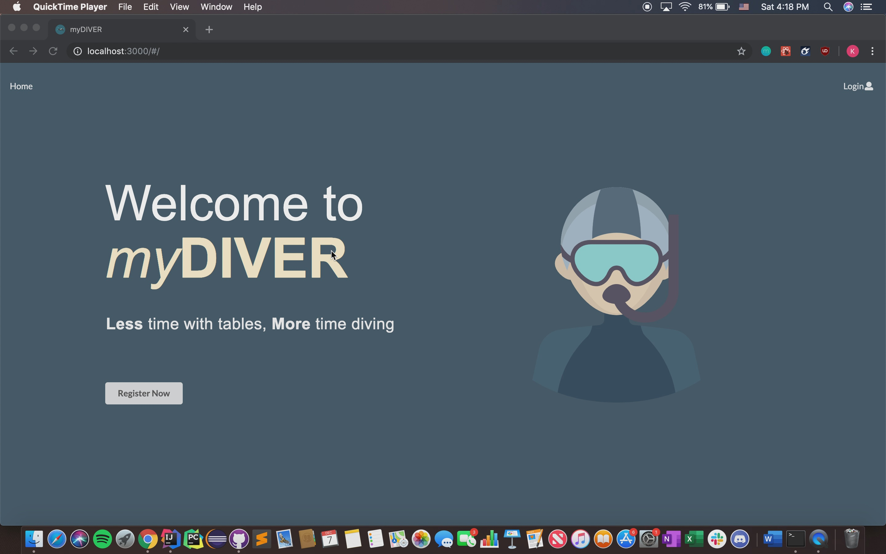

## myDiver Web Application
This web application allows users to plan their dive sessions through our website. 
Our algorithm implements the PADI table by putting the PADI table data into hash tables. 
The user interface was created by using Semantic UI React. 
 
This web application was created for my ICS 414 project at University of Hawai'i at Manoa, Fall 2019. I was mostly in charge of developing the user interface and the website interaction with the user. 
[GitHub Repository](https://github.com/ken-10/SCUBA)  
[Video Demo of the Web App](https://youtu.be/tZ-_kXJDwho) 
**Live Website Coming Soon**
 

