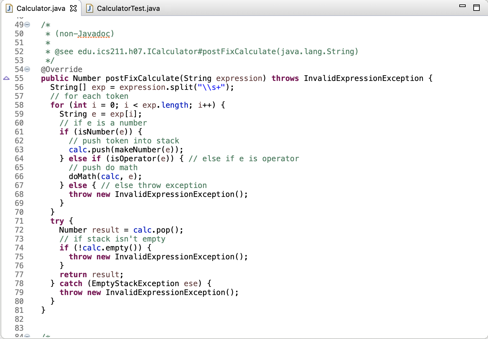
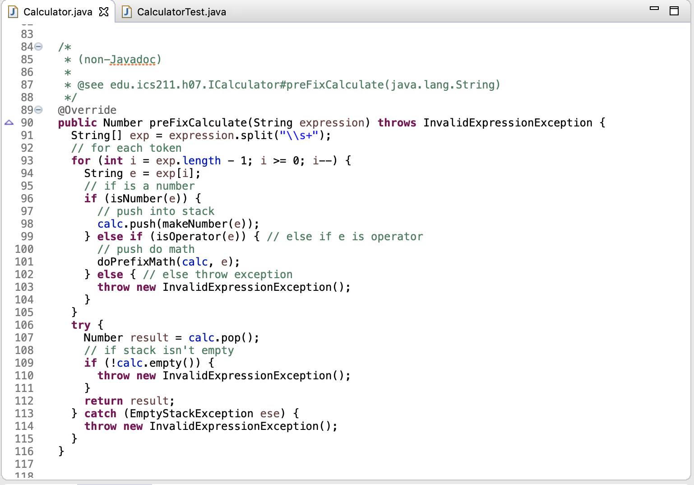

  
  

Postfix & Prefix Calculator is an assignment I did for my ICS 211 class ran by Carleton Moore, Fall 2018. This was an individual assignment that required us create a program in Eclipse, that can solve a math equation in postfix or prefix notation using the stack data type in Java. The calculator needed to compute any expression that was a floating point or integer using the +,-,/, or * operator. Negative numbers were ignored in this assignment. The calculator also needed to solve math in the way Java would; if two operands are integers, then it needs to do integer math, else it shall do floating point math.

In this assignment, it really pushed me to start thinking critically when it comes to solving problems. Instead of diving straight into a problem by writing the code, it made me sit down and start drawing out on pencil and paper, how the stack calculator functions and do an example problem on paper. After I figured out how the calculator should work, I began to write out the algorithm in comments, then I began to implement actual code. This assignment taught me how to solve problems efficiently and I adopted this work style when I code. 

Example code of the postfix portion: 

    public Number postFixCalculate(String expression) throws InvalidExpressionException {
    String[] exp = expression.split("\\s+");
    // for each token
    for (int i = 0; i < exp.length; i++) {
      String e = exp[i];
      // if e is a number
      if (isNumber(e)) {
        // push token into stack
        calc.push(makeNumber(e));
      } else if (isOperator(e)) { // else if e is operator
        // push do math
        doMath(calc, e);
      } else { // else throw exception
        throw new InvalidExpressionException();
      }
    }
    try {
      Number result = calc.pop();
      // if stack isn't empty
      if (!calc.empty()) {
        throw new InvalidExpressionException();
      }
      return result;
    } catch (EmptyStackException ese) {
      throw new InvalidExpressionException();
    }
  }

