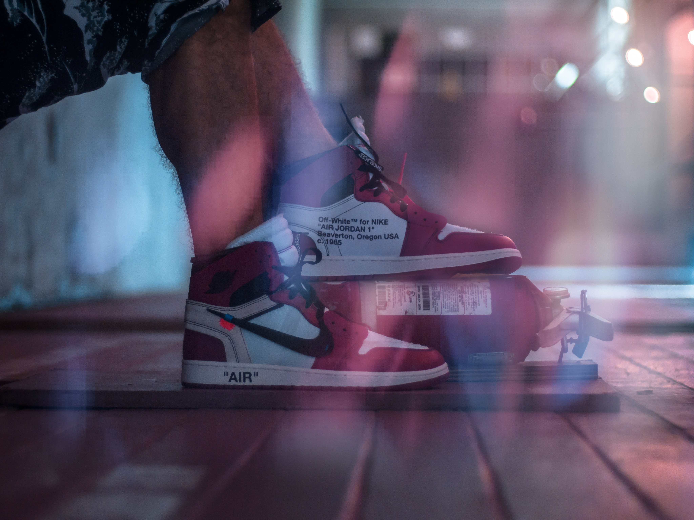

Photography is a hobby I began during my senior year of highschool, the year 2017. My interest in photography began after I bought my first camera, Canon T5 rebel, from my friend. Although, it wasn't the best camera, it helped me learn the basics of photography. From that day on, I saved up money and bought a camera that was more portable and better. Shortly after, I began adventuring through Oahu and took one of my favorite pictures:

  

This was a hike to Maunawili Falls and me and my friend found an abandoned bridge. After I graduated, I traveled to Japan with a few of my buddies and went to many places such as: Tottori Sand Dunes and Team Lab Museum. 

  

I am glad that I began doing photography as a hobby because it taught me how to use my creativity to the fullest. You need to keep your mind running and thinking of angles and compositions for a nice shot, and after you have taken the picture, you still need to edit it. That is where you need to have an imagination of how you want the colors of you picture. Having creativity means you can be original and this is something the education system doesn't teach. Why do certain products succeed and others don't? If you pay attention, products that do the best, are the most original ones. People are always looking for something new and being able to always think outside the box can bring original ideas to life. 
