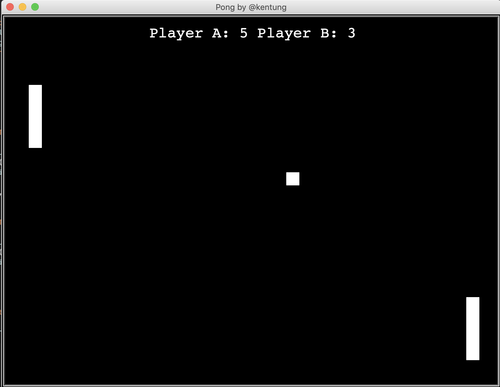

## A Simple Game of Pong
I created this game for fun as an introductory to Python for myself. There are two paddles, one on the left and one on the right. The ball begins at the middle of the screen and bounces off the top and bottom borders and the two paddles. If it hits the left or right borders of the screen, it resets in the middle. If the ball hits the left border, Player B gets a point, vice versa.

