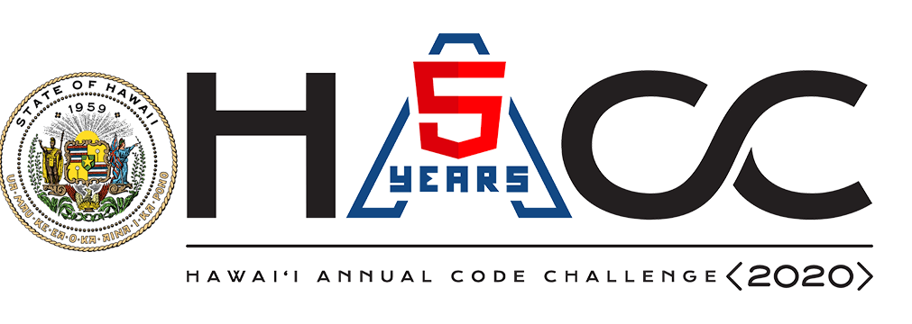
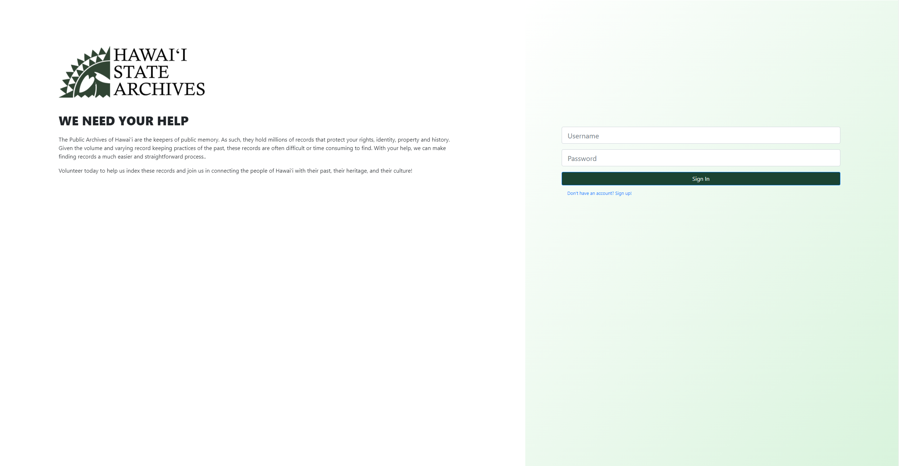
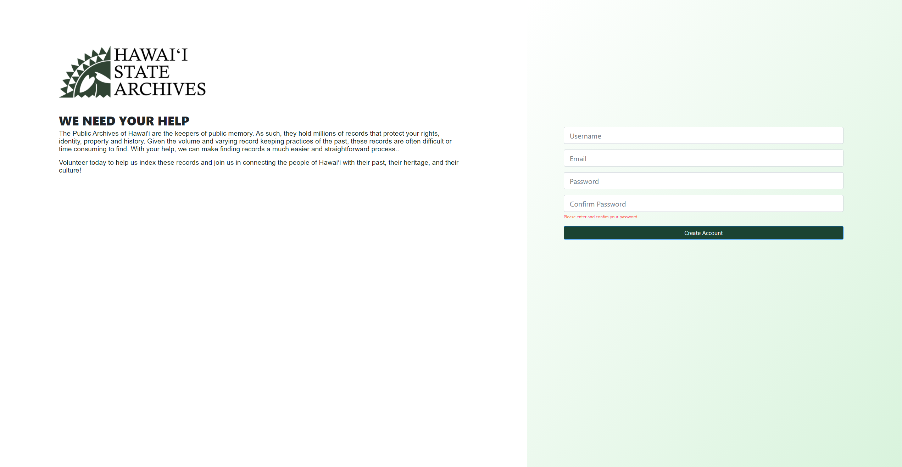

# Purpose
Project CLIO was created as a submission to the [Hawaii Annual Coding Challenge 2020](https://hacc.hawaii.gov/). The challenge was created to provide opportunity for civic engagement to the local technology community to create innovative solutions in state functions and services. Another objective of this challenge is to facilitate information technology workforce development and stimulate the development of ideas that may lead to technology business and economic development for the participants. One of the challenges presented was to develop a online platform that allows Hawai'i State Archives to gamify and crowdsource their indexing, which my team and I have chose to tackle. 

# About Project CLIO
Project CLIO is a web application created with React & Javascript for the front-end and Spring & Java for the back-end of the application. The web application categorizes users into four categories: rookie, indexer, proofer, and archivist. The rookie role is a role every user is assigned when they first sign up and they must go through training of how to index archives. After the tutorial is complete, the are promoted to an indexer. Indexer are regular users that can index archives and do other basic user functions such as edit their profile and view leaderboards. Proofers are users who can proof-read index submissions by indexers and can decide whether the submission passes or not. Archivists are the admins of the website where they can do every function of every user below them and on top of that, they may export submissions in a CSV file, create new archives to be indexed, and categories. Badges and leaderboards are utilized to create a gaming aspect in hopes to encourage users to index archives. Below is a link to a video that shows how the website functions.  
 

# Walkthrough
 

# Team Members & Experience
I was fortunate enough to work with four other hard working individuals listed below.
* [Arslan Rakhmankulov](https://github.com/arslan-r)
* [Jennifer Hsu](https://github.com/jhsuP)
* [Gum Aung](https://github.com/gumsanaung)
* [Trey Sumida](https://github.com/trey-sumida) 

We were able to split up the work evenly between us five members. Trey, Gum, and I were assigned to the back-end of the application, while Arsland and Jenny were responsible for the front-end of the website. Before we started coding anything, we decided as a group what technology stacks we were going to use and how we wanted to organize backend data. I feel like this played a big part in avoiding mistakes during development. If we never planned out how we wanted to organize the backend data, I feel like improvisng it would have led to many on the spot changes and that itself would have set us back a lot. We also held group meetings 4-6 days a week and during each meeting, we discussed what we had done and improvements to do next. This constant stream of communication played a major role in completing the project and being able to make it to the final presentation rounds of the hackathon. 
 
However, not everything was sunshine and rainbows. My group members and I faced many challenges throughout this hackathon. Trey and I have never worked on a backend of a project and Gum also has never worked with the Spring framework before, therefore there was a huge learning curve for all of us in the backend team. Luckily, we were able to pull through by helping one another understand how to create models, repositories, and endpoints. Towards the end of the hackathon, we needed to connect the front and backend of the project together. While doing so, we encountered several communication issues where the API endpoints I created were not exactly what the front end wanted. I feel like this could have been avoided if each party clearly stated what they wanted and better questions were asked.  
 
Overall, this hackathon was a great learning experience for me. I learned how it feels to work on a backend of an application and what it takes to communicate well with multiple team members. I was quite impressed with how well I learned Spring framework material in a span of two weeks and it goes to show that if I am able to put time and effort into something, I can make it go a long way. This was hackathon was a great first time experience for me and I definitely want to participate in the HACC again.

# Screenshots
### Login Page
 
### Sign up Page
 
# Links
[GitHub](https://github.com/HACC2020/ByteCryb)  
[Devpost](https://devpost.com/software/project-clio)  

