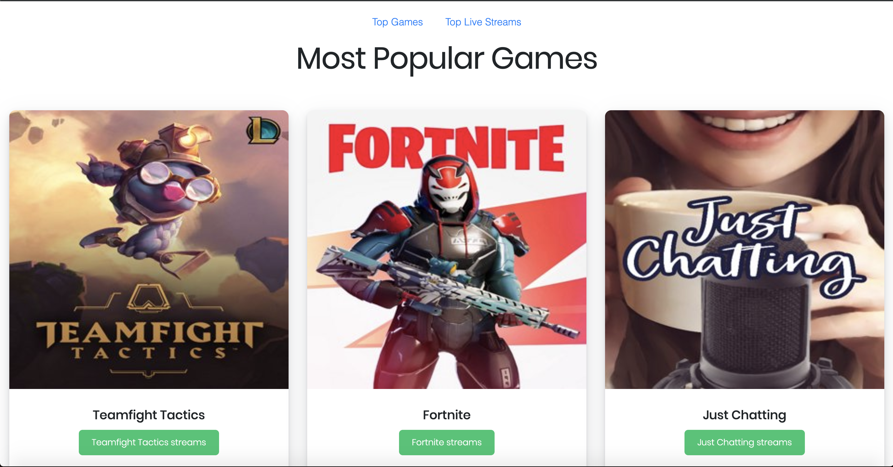

## Top Live Streams on Twitch
This webpage allows you to view the most popular games on Twitch and view the top live streams for that specific game. Another option is to view the general top live streams on Twitch. When you are on the page that displays the top live stream for a specific game, it also displays the total viewers watching people play that game and then in multiple card boxes the livestreamer and their current view count. 
 
[Website Link](https://nfp9i.codesandbox.io/)  
 

