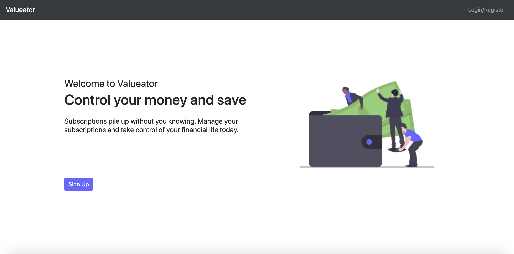
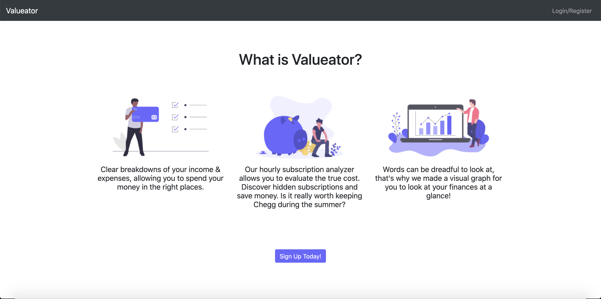
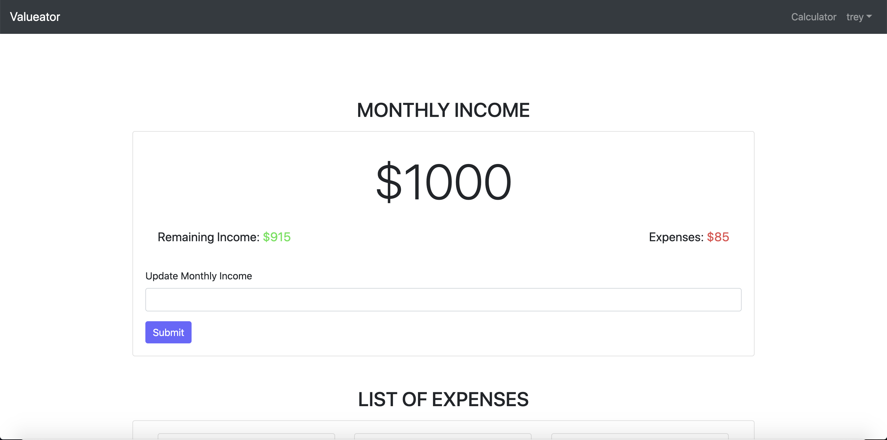
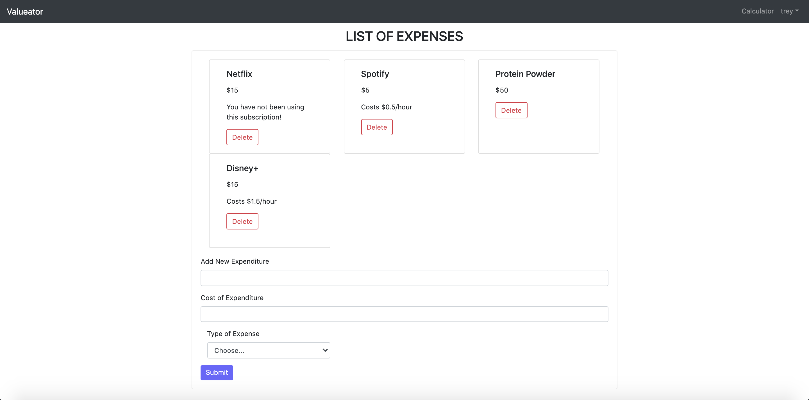
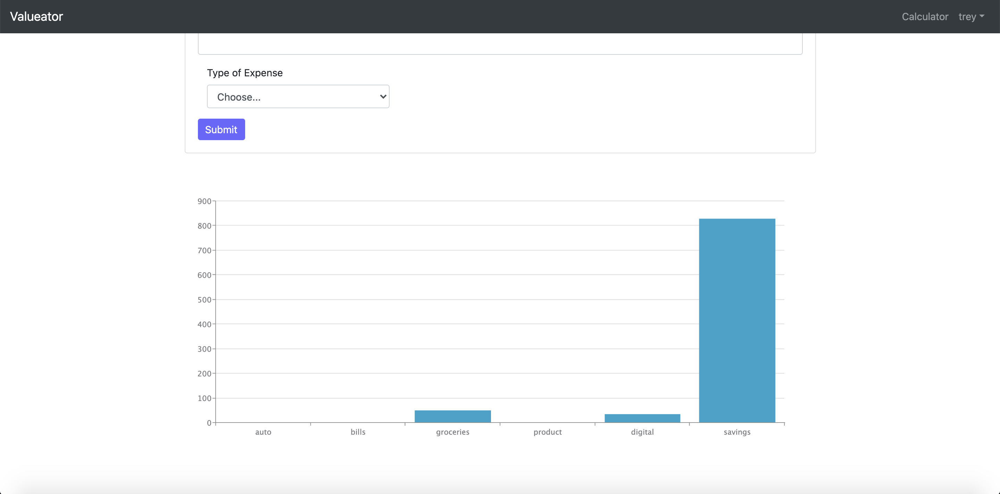

# Valueator

[GitHub Repository](https://github.com/trey-sumida/Valueator)  
[View the Project on Devpost](https://devpost.com/software/valueator) 
[Video Demo](https://www.youtube.com/watch?v=czIYX9DYL6A) 
 

## Inspiration
Every year there are new digital subscription services releasing providing various new things. Paying for these services such as Hulu, Netflix, Disney+ and more can add up in a hurry and who has the time to actually use all those services each month! We as a team wanted to create our own finance tracker that focused on the monthly subscription base services, and seeing whether or not it is really worth it for us to keep. 
## What it does
After putting in your monthly income, and adding your expenses for a month, you will be shown a chart that breaks down the different categories of how you spend your money. Our application will also show how much you are paying hourly for the online subscription based services.
## How we built it
Valueator was built using the django framework, bootstrap 4, and along with some javascript and jquery. 
## Challenges we ran into
Our biggest challenge was trying to come up with an idea that would separate our product from the rest. This is how we came to the conclusion of focusing on the subscription based services.
## Accomplishments that we're proud of
Django is a somewhat new experience for our team and we feel that we made a pretty decent application in the 36 hours we had to work on it.
## What we learned
Our group learned how to product manage by assigning tasks to one another so that we wouldn't conflict with what the other person is working on at the time and kept strong communication throughout development.
## What's next for Valueator
There are a lot of improvements that can be made to Valueator such as suggesting alternatives to certain expenses or possibly having the ability to compare your expenses to others in the same income bracket. A possible feature is where users can link their screen time data from their phones can be used to calculate an accurate hourly cost for digital subscriptions if an phone app version of this were to be created. The room for improvement is endless.
## Screenshots

### Landing Page

### Budgeting App Page (Monthly Income Stats)

### List of User's Expenses

### Graph of User's Expenses and Savings

